# 🧭 SmartTravel — Offline-First Intelligent Road Trip Platform

> Production-grade, offline-first intelligent travel planner with multi-day itinerary scheduling, deterministic route optimization, live weather forecasting, verified hotel discovery, emergency safety calling, and grounded AI assistance.

---

## 🌟 Key Features

1. **🗺️ Intelligent Route Planning & Deterministic Optimization**:
   - Multi-waypoint route calculation with turn-by-turn maneuvers and toll/highway avoidance.
   - Deterministic TSP permutation ($N \le 7$) & 2-Opt local search ($N > 7$) to optimize stop order and eliminate path crossings.
   - Corridor-based POI discovery across 10 verified categories (Attractions, Food, Hotels, Fuel/EV, Hospitals, Police, Mechanics, Pharmacies, ATMs, Parking).

2. **📅 Multi-Day Itinerary Engine**:
   - Day-by-day scheduling with automatic arrival, departure, and stay duration calculations.
   - Interactive day tabs (`Day 1`, `Day 2`, `+ Add Day`), drag/reorder controls, and inter-day stop transfers.
   - Server-side itinerary recalculation and cloud sync.

3. **🌤️ Meteorological Forecast & Severe Weather Warnings**:
   - Open-Meteo integration providing current metrics (temperature, humidity, precipitation, wind speed) and 5-day forecasts.
   - Route-wide severe weather warnings (`🔥 Extreme Heat`, `🌧️ Heavy Rain`, `⚡ Thunderstorm`, `💨 High Wind`, `🌫️ Dense Fog`, `❄️ Cold Weather`).

4. **🏨 Verified Hotel & Room Directory**:
   - Live Overpass OpenStreetMap extraction for verified hotels, motels, guest houses, and hostels.
   - Filter by radius (1–30 km), star rating, budget range, check-in dates, and verified amenities (WiFi, pool, parking, AC, pet-friendly).
   - Direct booking deep links (Google Maps, Booking.com, Agoda, MakeMyTrip).

5. **🚨 Emergency Support & Safety Hub**:
   - Immediate GPS coordinates with human-readable reverse geocoded address.
   - Automatic nearby emergency services locator (Police, Hospitals, 24/7 Pharmacies, Fuel Plazas, Mechanics).
   - Saved emergency contacts with native `tel:` emergency dialing and 3-second safety countdown.
   - One-tap Web Share / clipboard location broadcasting.

6. **🧭 Live Trip Mode & Route Deviation Detection**:
   - Real-time GPS tracking with speed, 8-point compass heading, and GPS accuracy ($\pm X\text{m}$).
   - Cross-track geodesic corridor deviation engine alerting if off-route ($> 150\text{m}$) with one-click recalculation.
   - Dynamic ETA updating live based on device speed and remaining distance.

7. **✨ Grounded AI Travel Assistant**:
   - Modular AI architecture decoupled from any single vendor.
   - Powered by Google Gemini 2.5 Flash with deterministic Grounded Rule Engine fallback adhering strictly to the **NO FAKE DATA** rule.
   - Structured recommendation outputs for itineraries, POIs, stop ordering, and safety summaries.

8. **💾 Offline-First Architecture & Cryptographic Integrity**:
   - Client-side IndexedDB storage (`localforage`) for offline trips and map packs.
   - Portable `.json` trip pack exports with SHA-256 checksums and schema integrity validation.
   - 100% offline viewing and checklist management.

---

## 🏗️ Architecture & Component Design

```mermaid
graph TD
    Client[Frontend: React 19 + Vite + TailwindCSS + Leaflet] -->|REST API + JWT| Gateway[Express.js Server]
    
    subgraph Security & Middlewares
        Gateway --> Helmet[Helmet Headers]
        Gateway --> CORS[Strict CORS Whitelist]
        Gateway --> RateLimit[Express Rate Limiter]
        Gateway --> AuthMiddleware[JWT Auth & Ownership Verification]
    end

    subgraph Core Services & Adapters
        Gateway --> TripService[Trip & Multi-Day Itinerary Engine]
        Gateway --> RouteOptimizer[Deterministic TSP & 2-Opt Optimizer]
        Gateway --> GeocodingAdapter[Nominatim Geocoding Adapter]
        Gateway --> RoutingAdapter[OSRM Routing Adapter]
        Gateway --> PlacesAdapter[Overpass OpenStreetMap Adapter]
        Gateway --> WeatherAdapter[Open-Meteo Forecasting Adapter]
        Gateway --> HotelAdapter[Hotel & Amenity Provider]
        Gateway --> EmergencyService[Emergency Hub & Contact Manager]
        Gateway --> AIModule[Modular AI Assistant & Context Builder]
    end

    subgraph Caching & Database
        GeocodingAdapter --> CacheService[TTL SimpleCache Layer]
        RoutingAdapter --> CacheService
        PlacesAdapter --> CacheService
        WeatherAdapter --> CacheService
        TripService --> MongoDB[(MongoDB Atlas)]
        EmergencyService --> MongoDB
    end

    subgraph AI Providers
        AIModule --> GeminiProvider[Google Gemini 2.5 Provider]
        AIModule --> GroundedProvider[Grounded Rule Engine Fallback]
    end
```



---

## ⚙️ Environment Variables

### Backend (`backend/.env`)

| Variable | Required | Description | Example |
| :--- | :---: | :--- | :--- |
| `PORT` | No | Server port (default: `5000`) | `5000` |
| `NODE_ENV` | Yes | Application environment | `development` / `production` |
| `MONGO_URI` | Yes | MongoDB Atlas connection string | `mongodb+srv://...` |
| `JWT_SECRET` | Yes | Strong secret key for signing tokens | `min_32_char_random_secret` |
| `FRONTEND_URL` | Yes | Allowed frontend origin for CORS | `http://localhost:5173` |
| `GEMINI_API_KEY` | No | Google GenAI API key for AI assistant | `AIzaSy...` |
| `GEMINI_MODEL` | No | Gemini model name (default: `gemini-2.5-flash`) | `gemini-2.5-flash` |
| `AI_PROVIDER` | No | AI Provider backend (`gemini` or `grounded`) | `gemini` |

---

## 📡 REST API Reference

### 🔐 Authentication (`/api/auth`)
- `POST /api/auth/register` — Register a new account (`email`, `password` $\ge 12$ chars).
- `POST /api/auth/login` — Sign in and receive signed JWT.
- `GET /api/auth/me` — Retrieve current authenticated user profile (`Bearer <token>`).

### 📍 Locations & Routing (`/api/locations`)
- `GET /api/locations/autocomplete?q=:query` — Autocomplete location search via Nominatim.
- `POST /api/locations/route` — Calculate driving route, maneuvers, and corridor POIs (`start`, `destination`, `waypoints`, `filters`, `avoidTolls`, `avoidHighways`, `optimize`).
- `GET /api/locations/reverse?lat=:lat&lon=:lon` — Human-readable reverse geocoding.

### 🚗 Trips & Itineraries (`/api/trip`)
- `GET /api/trip` — List all saved trips for authenticated user.
- `POST /api/trip` — Save a new trip with multi-day itinerary schedule.
- `PUT /api/trip/:id` — Update trip notes or details.
- `PUT /api/trip/:id/itinerary` — Save custom multi-day itinerary schedule.
- `POST /api/trip/recalculate` — Recalculate route segments, distances, durations, and geometry.
- `PATCH /api/trip/:id/favorite` — Toggle trip favorite status.
- `DELETE /api/trip/:id` — Delete a saved trip.
- `POST /api/trip/:id/share` — Generate unique share token.
- `GET /api/trip/shared/:shareId` — Public read-only trip snapshot.

### 🌤️ Weather Forecasting (`/api/weather`)
- `GET /api/weather/point?lat=:lat&lon=:lon` — Current weather metrics and 5-day daily forecast.
- `POST /api/weather/route` — Aggregated severe weather warnings across route points.

### 🏨 Hotels & Accommodations (`/api/hotels`)
- `GET /api/hotels/nearby?lat=:lat&lon=:lon&radius=:m` — Search verified hotels with amenities.

### 🚨 Emergency Support (`/api/emergency`)
- `GET /api/emergency/nearby?lat=:lat&lon=:lon&radius=:m` — Nearby police, hospitals, and pharmacies.
- `GET /api/emergency/contacts` — List saved emergency contacts.
- `POST /api/emergency/contacts` — Add new emergency contact.
- `DELETE /api/emergency/contacts/:id` — Delete emergency contact.

### ✨ AI Travel Assistant (`/api/ai`)
- `POST /api/ai/chat` — Conversational travel assistant query grounded on route POIs.
- `POST /api/ai/itinerary` — AI-drafted multi-day itinerary.
- `POST /api/ai/structured` — Structured JSON recommendation (`itinerary`, `poi`, `safety`).

---

## 🗄️ Database Schemas & Data Relationships

```text
User
 ├── _id (ObjectId)
 ├── email (String, unique, indexed)
 ├── passwordHash (String, bcrypt)
 └── createdAt (Date)

Trip
 ├── _id (ObjectId)
 ├── user (ObjectId -> User, indexed)
 ├── start (name, lat, lon)
 ├── destination (name, lat, lon)
 ├── waypoints (Array of { name, lat, lon })
 ├── distance (Number, meters)
 ├── duration (Number, seconds)
 ├── coordinates (Polyline Array [[lat, lon], ...])
 ├── steps (Turn-by-turn maneuvers)
 ├── places (Array of verified POIs)
 ├── days (Array of TripDay)
 │    ├── dayNumber (Number)
 │    ├── title (String)
 │    └── stops (Array of TripStop: name, lat, lon, arrivalTime, departureTime, durationMinutes, stayType)
 ├── favorite (Boolean, indexed)
 ├── shareId (String, unique, sparse, indexed)
 └── createdAt (Date, indexed)

EmergencyContact
 ├── _id (ObjectId)
 ├── user (ObjectId -> User, indexed)
 ├── name (String)
 ├── phone (String)
 ├── relationship (String: Family, Friend, Doctor, Emergency Contact)
 └── notes (String)
```

---

## 🔒 Security Architecture

- **HTTP Security Headers**: `helmet` configured with strict Content Security Policies.
- **Cross-Origin Resource Sharing (CORS)**: Strict origin validation allowing only trusted frontend URLs.
- **Rate Limiting**: `express-rate-limit` protecting API endpoints (100 req/15min in production).
- **Authentication & Ownership**:
  - Passwords hashed with bcrypt (salt rounds: 10).
  - JWT tokens signed with strong secrets and 7-day expiration.
  - All database queries for user trips and emergency contacts explicitly enforce `{ user: req.user.id }`.
- **Zero Vulnerabilities**: 0 vulnerabilities reported across all dependencies (`npm audit`).

---

## 🧪 Testing & Verification

### Running Backend Unit & Integration Tests (44 Tests)
```bash
cd backend
npm test
```
**Test Coverage Includes**:
- `authController.test.js`: Hashing, JWT creation, token expiry, rejection.
- `tripRoutes.test.js`: Multi-day model, route segment calculations, optimization.
- `routeOptimizer.test.js`: Deterministic permutation and 2-opt search.
- `weatherProvider.test.js`: WMO code decoding and severe warning rules.
- `hotelService.test.js`: Amenity filtering and booking link formatting.
- `emergencyService.test.js`: Contact validation and nearby emergency facilities.
- `aiProvider.test.js`: Modular AI provider and structured recommendation parsing.
- `cacheService.test.js`: TTL expiration, LRU eviction, and max entries limits.

### Running End-to-End Automated Browser Test
```bash
node scratch/verify_phase19_e2e_journey.js
```

### Running Frontend Linting & Production Build
```bash
cd frontend
npm run lint
npm run build
```

---

## 🚀 Deployment & Production Build

### 1. Build Frontend Client
```bash
cd frontend
npm install
npm run build
```
*Outputs optimized client bundle to `frontend/dist` with code-splitting (`AITravelAssistant`, `EmergencyHubModal`, `HotelSearchModal` lazy loaded on demand).*

### 2. Start Production Server
```bash
cd backend
npm install --production
npm start
```
*The Express server automatically detects `frontend/dist` and serves the static production SPA along with `/api/*` routes on the configured port.*

---

## 🛠️ Troubleshooting

1. **Database connection timeout**:
   - Check `MONGO_URI` in `backend/.env`.
   - Ensure MongoDB Atlas IP Whitelist allows your server's outbound IP (or `0.0.0.0/0` for development).
2. **CORS errors in browser**:
   - Ensure `FRONTEND_URL` in `backend/.env` exactly matches your browser origin (e.g. `http://localhost:5173`).
3. **AI Assistant fallback mode**:
   - If `GEMINI_API_KEY` is not provided, SmartTravel automatically activates the deterministic **Grounded Rule Engine** without breaking or hallucinating data.
